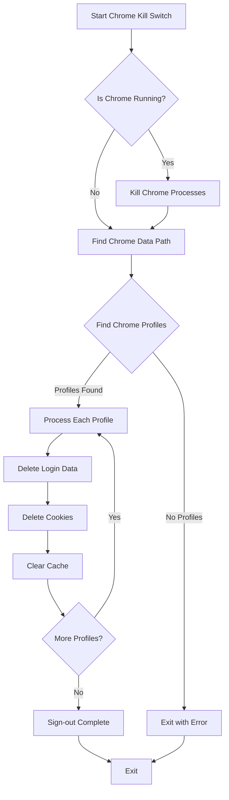

# 🔐 Chrome Kill Switch

A Python tool to sign out of Chrome profiles and clear passwords and cache on your PC.

## 🚀 What it does

This tool performs the following actions:
- 🛑 Forcefully closes any running Chrome processes
- 🔍 Finds all Chrome profiles on the system
- 🗑️ Removes sensitive files containing login data and passwords
- 🧹 Clears the browser cache
- 🔒 Effectively signs you out of all profiles

## 📊 Process Flow



## 📋 How to use

### ▶️ Direct Python execution

1. Make sure you have Python installed (Python 3.6 or later recommended)
2. Run the script directly:
   ```
   python chrome_kill_switch.py
   ```

### 📦 Ready-to-use Executable

A standalone executable is available in this repository. You can find it at:
```
build/exe.win-amd64-3.12/ChromeKillSwitch.exe
```

Simply run this executable on any Windows PC to clear Chrome passwords and sign out of profiles. No Python installation required!

### 🛠️ Building your own executable

If you want to create your own executable:

#### Option 1: Using PyInstaller

1. Install PyInstaller:
   ```
   pip install pyinstaller
   ```

2. Generate the executable:
   ```
   pyinstaller --onefile chrome_kill_switch.py
   ```

3. The executable will be created in the `dist` directory

#### Option 2: Using cx_Freeze (✅ Recommended)

1. Install cx_Freeze:
   ```
   pip install cx_freeze
   ```

2. Build the executable:
   ```
   python setup.py build
   ```

3. The executable will be available at:
   ```
   build/exe.win-amd64-3.12/ChromeKillSwitch.exe
   ```

## 🔐 Security Notes

- 🧹 This tool deletes sensitive data from your Chrome profiles
- 🔑 It focuses on password data, cookies, and cache, which should effectively sign you out
- ✅ For maximum security, you may also want to manually go to chrome://settings/passwords and verify
- ⚠️ Use at your own risk and ensure you understand what files are being removed

## 💻 Compatibility

- 🪟 Windows: Fully supported and tested
- 🍎 macOS: Should work but not extensively tested
- 🐧 Linux: Should work but not extensively tested