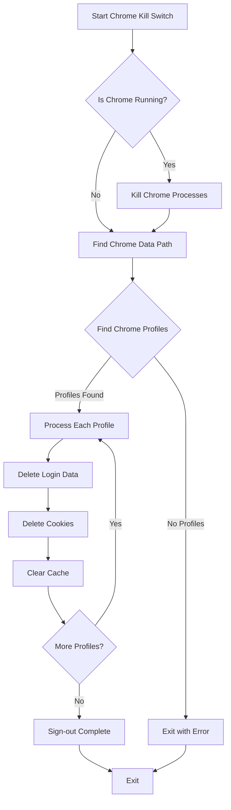

<h1 align="center"><a href="https://github.com/ronknight/chrome-kill-switch">☠️Chrome Kill Switch</a></h1>
<h4 align="center">A Python tool to sign out of Chrome profiles and clear sensitive browser data securely.
</h4>

<p align="center">
<a href="https://twitter.com/PinoyITSolution"></a>
<a href="https://github.com/ronknight?tab=followers"></a>
<a href="https://github.com/ronknight/ronknight/stargazers"></a>
<a href="https://github.com/ronknight/ronknight/network/members"></a>
<a href="https://youtube.com/@PinoyITSolution"></a>
<a href="https://github.com/ronknight/chrome-kill-switch/issues"></a>
<a href="https://github.com/ronknight/chrome-kill-switch/blob/master/LICENSE"></a>
<a href="#"></a>
<a href="https://github.com/ronknight"></a>
</p>

<p align="center">
  <a href="#requirements">Requirements</a> •
  <a href="#usage">Usage</a> •
  <a href="#process-flow">Process Flow</a> •
  <a href="#security-features">Security Features</a> •
  <a href="#compatibility">Compatibility</a>
</p>

---

## 🚀 What it does

This tool performs the following actions:
- 🛑 Forcefully closes any running Chrome processes
- 🔍 Finds all Chrome profiles on the system
- 🗑️ Removes sensitive files containing login data, passwords, and web data
- 🧹 Clears browser cache, cookies, and session data
- 🔒 Effectively signs you out of all profiles
- 📊 Provides detailed progress feedback
- 🔄 Implements retry mechanisms for reliable cleanup

## 📊 Process Flow



## 📋 Usage

### Requirements
- Python 3.6 or later (for direct Python execution)
- Windows, macOS, or Linux operating system

### ▶️ Direct Python execution

1. Make sure you have Python installed (Python 3.6 or later recommended)
2. Run the script directly:
   ```
   python chrome_kill_switch.py
   ```

### 📦 Ready-to-use Executable

A standalone executable is available in this repository. You can find it at:
```
build/exe.win-amd64-3.12/ChromeKillSwitch.exe
```

Simply run this executable on any Windows PC to clear Chrome data and sign out of profiles. No Python installation required!

### 🛠️ Building your own executable

You can create your own executable using cx_Freeze (✅ Recommended):

1. Install cx_Freeze:
   ```
   pip install cx_freeze
   ```

2. Build the executable:
   ```
   python setup.py build
   ```

3. Find the executable at:
   ```
   build/exe.win-amd64-3.12/ChromeKillSwitch.exe
   ```

## 🔐 Security Features

- 🔄 Multiple retry attempts for reliable process termination
- 🧹 Comprehensive cleanup of sensitive browser data
- 🔒 Removes login credentials, cookies, and session data
- 💾 Clears cache storage and local storage
- 📱 Handles sync data and device information
- ⚡ Fast and efficient operation with progress feedback
- 🛡️ Graceful error handling and recovery

## 🗑️ Data Cleaned

The tool removes or clears the following data:
- Login credentials and passwords
- Cookies and session data
- Browsing history
- Cache and temporary files
- Local storage and IndexedDB
- Sync data and device information
- Autofill data
- Secure preferences
- Network and quota data

## 💻 Compatibility

- 🪟 Windows: Fully supported and extensively tested
- 🍎 macOS: Basic support implemented
- 🐧 Linux: Basic support implemented

## ⚠️ Important Notes

- Always close Chrome before running this tool
- The tool will attempt to force-close Chrome if it's running
- For maximum security, verify in chrome://settings/passwords after running
- Consider backing up any important bookmarks before running
- Some files may be locked by the system and require multiple cleanup attempts