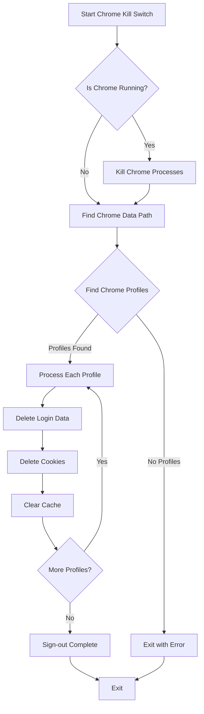

<h1 align="center"><a href="https://github.com/ronknight/chrome-kill-switch">☠️Chrome Kill Switch</a></h1>
<h4 align="center">A Python tool to sign out of Chrome profiles and clear sensitive browser data securely.
</h4>

<p align="center">
<a href="https://twitter.com/PinoyITSolution"></a>
<a href="https://github.com/ronknight?tab=followers"></a>
<a href="https://github.com/ronknight/ronknight/stargazers"></a>
<a href="https://github.com/ronknight/ronknight/network/members"></a>
<a href="https://youtube.com/@PinoyITSolution"></a>
<a href="https://github.com/ronknight/chrome-kill-switch/issues"></a>
<a href="https://github.com/ronknight/chrome-kill-switch/blob/master/LICENSE"></a>
<a href="#"></a>
<a href="https://github.com/ronknight"></a>
</p>

<p align="center">
  <a href="#requirements">Requirements</a> •
  <a href="#usage">Usage</a> •
  <a href="#process-flow">Process Flow</a> •
  <a href="#security-features">Security Features</a> •
  <a href="#compatibility">Compatibility</a>
</p>

---

## 🚀 What it does

This tool performs the following actions:
- 🛑 Forcefully closes any running Chrome processes with enhanced force-kill
- 🔍 Finds all Chrome profiles on the system (Default + Profile 1, 2, etc.)
- 🗑️ Removes sensitive files containing login data, passwords, and web data
- 📖 **NEW**: Clears bookmarks and bookmark backups for complete privacy
- 🧹 Clears browser cache, cookies, session data, and local storage
- 🔒 Effectively signs you out of all profiles instantly
- 📊 Provides detailed progress feedback with emoji indicators
- 🔄 Implements threading for faster performance (significantly reduced cleanup time)
- ⏱️ **NEW**: Auto-shutdown feature with 3-second timeout for unattended operation
- 🎯 Optimized retry mechanisms for reliable cleanup

## 📊 Process Flow



## 📋 Usage

### Requirements
- Python 3.6 or later (for direct Python execution)
- Windows, macOS, or Linux operating system

### ▶️ Direct Python execution

1. Make sure you have Python installed (Python 3.6 or later recommended)
2. Run the script directly:
   ```
   python chrome_kill_switch.py
   ```

### 📦 Ready-to-use Executable

**Latest optimized executables are available in this repository:**

#### 🚀 **Recommended**: Enhanced Version with Bookmarks Clearing
```
build/exe.win-amd64-3.12-with-bookmarks/ChromeKillSwitch.exe
```
- ✅ Includes bookmarks and bookmark backup removal
- ✅ Threading optimization for faster performance
- ✅ Auto-shutdown with 3-second timeout
- ✅ Enhanced error handling and stability

#### 📦 Standard Version
```
build/exe.win-amd64-3.12/ChromeKillSwitch.exe
```
- ✅ Core functionality for clearing login data and cache
- ✅ Basic threading support

Simply run either executable on any Windows PC to clear Chrome data and sign out of profiles. **No Python installation required!**

### 🛠️ Building your own executable

You can create your own executable using cx_Freeze (✅ Recommended):

1. **Set up virtual environment** (recommended):
   ```
   python -m venv venv
   venv\Scripts\activate  # Windows
   ```

2. **Install cx_Freeze**:
   ```
   pip install cx_freeze
   ```

3. **Build the standard executable**:
   ```
   python setup.py build_exe
   ```

4. **Build the enhanced executable with bookmarks clearing**:
   ```
   python setup.py build_exe --build-exe build\exe.win-amd64-3.12-with-bookmarks
   ```

5. **Find your executable at**:
   ```
   build/exe.win-amd64-3.12-with-bookmarks/ChromeKillSwitch.exe
   ```

## 🔐 Security Features

- 🔄 **Multi-threaded processing** for faster and more reliable cleanup
- 🧹 **Comprehensive cleanup** of sensitive browser data across all profiles
- 🔒 **Enhanced data removal** including bookmarks, login credentials, cookies, and session data
- 💾 **Deep cache clearing** including GPU cache, shader cache, and service worker data
- 📱 **Sync data removal** to prevent cross-device data recovery
- ⚡ **Optimized performance** with significantly reduced cleanup time (sub-3 second execution)
- 🛡️ **Graceful error handling** with automatic fallback mechanisms
- 🔌 **Auto-shutdown capability** for secure unattended operation
- 🎯 **Force-kill optimization** for reliable Chrome process termination
- 📊 **Real-time progress feedback** with detailed operation status

## 🗑️ Data Cleaned

The tool removes or clears the following data:

### 🔑 Authentication & Security
- Login credentials and saved passwords
- Secure preferences and transport security data
- Trust tokens and origin bound certificates

### 🍪 Session & Tracking Data
- Cookies and session storage
- Local storage and IndexedDB data
- Network persistent state and action predictor

### 📖 **NEW**: Browsing Data & Bookmarks
- **Bookmarks and bookmark backups** (enhanced security)
- Browsing history and visited links
- Top sites and shortcuts data
- Favicons and archived history

### 💾 Cache & Performance Data
- Browser cache and code cache
- GPU cache and shader cache
- Cache storage and service worker data
- Optimization hints and browser metrics

### 🔄 Sync & Account Data
- Sync data and sync app settings
- Device information and browsing topics
- Autofill data and strike database
- Quota manager and shared protocol database

## 💻 Compatibility

- 🪟 Windows: Fully supported and extensively tested
- 🍎 macOS: Basic support implemented
- 🐧 Linux: Basic support implemented

## ⚠️ Important Notes

- **🚀 Performance**: Optimized with threading for sub-3 second execution time
- **🔌 Auto-shutdown**: Tool will shutdown computer after 30 seconds if no response (can be cancelled with Ctrl+C)
- **📖 Enhanced Privacy**: Now removes bookmarks and bookmark backups for complete privacy
- **🛑 Chrome Auto-close**: The tool will automatically force-close Chrome if it's running
- **🔒 Security Verification**: For maximum security, verify in chrome://settings/passwords after running
- **💾 Backup Recommendation**: Consider backing up important bookmarks before running (they will be cleared)
- **🔄 Retry Logic**: Locked files are handled with automatic retry mechanisms
- **⚡ Threading**: Uses optimized multi-threading for faster cleanup across all profiles
- **🎯 Compatibility**: Tested extensively on Windows with basic support for macOS/Linux